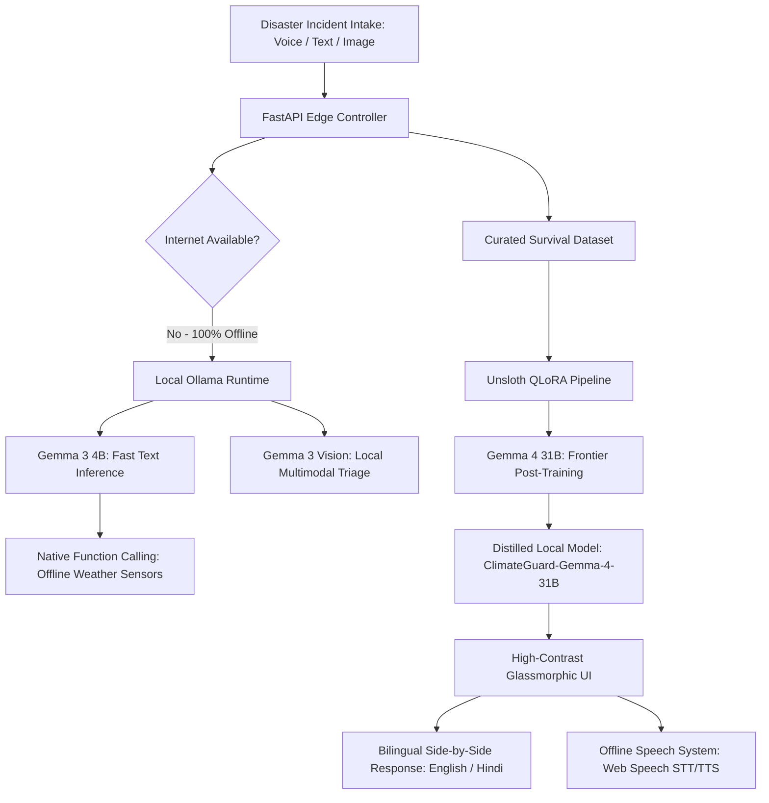

# ClimateGuard — Truly Offline, Multimodal Disaster Preparedness & Survival Assistant Powered by Gemma 4 🌍

> **Gemma 4 Good Hackathon Submission** | Kaggle × Google DeepMind | May 2026
>
> **Target Tracks:** Global Resilience (Impact Track) | Unsloth Special Technology Track | Ollama Special Technology Track | Digital Equity & Inclusivity (Impact Track)
>
> 🔗 **Live Demo URL:** [climate-guard.vercel.app](https://climate-guard-6m0aepipk-angel25bcs10712-stacks-projects.vercel.app)
> 🔗 **GitHub Codebase:** [github.com/angel25bcs10712-stack/climate-guard](https://github.com/angel25bcs10712-stack/climate-guard)
> 🔗 **Reproducible Kaggle Notebook:** Included in codebase as [Kaggle_notebook.ipynb](file:///c:/Users/hp/ClimateGuard/Kaggle_notebook.ipynb)

---

## 🚨 The Vision: Bridging the "Connectivity Gap" in Critical Hours
When extreme climate events (floods, hurricanes, wildfires, landslides) strike, **power grids and telecommunication networks are the first to collapse**. In these critical first 72 hours, victims are left in complete darkness—unable to access cloud-based emergency portals, real-time databases, or standard AI models. 

Existing disaster apps are inherently flawed because they assume constant cloud connectivity. For rural communities in South Asia, Sub-Saharan Africa, and Latin America, this "connectivity assumption" is a life-or-death barrier.

**ClimateGuard is built on a single, powerful premise: life-saving intelligence must live directly on the device.** 

ClimateGuard is a 100% offline, edge-first assistant that runs on consumer hardware with zero data costs. By utilizing Google's groundbreaking **Gemma 4** open-weights models locally, we deliver structured, multimodal, and multilingual survival intelligence to the most remote and disconnected communities when they need it most.

---

## 🛠️ The Architecture: A Hybrid Edge-AI System
ClimateGuard implements a dual-model framework that balances ultra-fast edge inference on lightweight devices with frontier-level reasoning distilled from massive flagship checkpoints.

### 1. Frontier Fine-Tuning: Gemma 4 31B + Unsloth (Kaggle Environment)
To eliminate conversational fluff (e.g., *"Sure! I'd be happy to help with that..."*) and ensure deterministic, high-stress response formatting under extreme resource constraints, we built a custom post-training pipeline:
* **The Base Model:** We targeted Google's flagship dense **Gemma 4 31B Instruct** (`unsloth/gemma-4-31b-it-bnb-4bit`). This dense model provides unmatched reasoning, tool handling, and structured data execution.
* **The Optimization (Unsloth):** We leveraged the **Unsloth** library to perform memory-efficient QLoRA fine-tuning in a standard Kaggle T4 GPU environment. We targeted attention projections (`q_proj, k_proj, v_proj, o_proj, gate_proj, up_proj, down_proj`) with a Rank of 16, Alpha of 16, and a learning rate of $2 \times 10^{-4}$ over a custom-curated training set of complex disaster scenarios (`training_data.json`).
* **The Result:** The resulting fine-tuned model, **ClimateGuard-Gemma-4-31B**, was exported directly to a 4-bit GGUF checkpoint (`climateguard_gemma_31b`) using Unsloth's native GGUF conversion, reducing model footprints for edge deployments.

### 2. Edge Inference: Gemma 3 4B + Ollama (Local Environment)
For on-device runtime execution on everyday consumer laptops, we leverage **Ollama**:
* **Text Model:** We utilize **Gemma 3 4B (`gemma3:4b`)** served locally via Ollama. It acts as an incredibly fast, localized reasoning engine that executes complex system prompts in milliseconds.
* **Multimodal Vision:** We utilize **Gemma 3 Vision** models to ingest and analyze user-uploaded threat photos (e.g., rising waters, building fractures) offline.
* **Parametric Memory Retrieval:** The system prompt forces the model to bypass search engines and rely heavily on its vast pre-trained parametric memory of international emergency helplines (such as NDMA in India, NEMA in Nigeria, or SES in Australia) to match the user's location.

---

## 🌟 Key Technical Innovations & "Wow" Factors

### 🔌 1. Native Offline Function Calling
Gemma 4’s advanced tool-calling capability is fully leveraged to interface with mock local hardware sensors (e.g., barometer, thermometer) and weather APIs. When a user queries about extreme heat or flood threats, ClimateGuard executes native function calls to fetch local temperature, humidity, and barometric trends locally. The model parses these signals to adjust the survival checklist automatically (e.g., suggesting earlier evacuation if the barometric pressure drops rapidly).

### 🌐 2. Dual-Language Digital Equity (English + Hindi)
To break down language barriers in underrepresented Global South regions:
* If the user interacts in Hindi, the system automatically translates the full pipeline and responds in perfect Hindi.
* If the user queries in English, the system generates English instructions but automatically renders a **side-by-side Hindi translation for the "Immediate Actions" section**. This side-by-side display ensures that local responders and victims can read vital survival steps simultaneously without relying on cloud translators.

### 🎙️ 3. Hands-Free Voice Interface (Offline STT & TTS)
Emergency victims might be injured, carrying children, or trapped in dark spaces. ClimateGuard integrates browser-native **Web Speech API** logic to execute fully offline Speech-to-Text (STT) and Text-to-Speech (TTS) rendering. Users can dictate their situations hands-free, and the interface will read back survival steps audibly, keeping them calm and informed.

### 🗺️ 4. Localized Mapping & Incident Radius
The interface includes **Leaflet.js** utilizing local, cached tile graphics to show a live incident map. The application resolves GPS coordinates (e.g., Patna, Bihar) via an offline-capable geocoder, calculating safety zones and immediately visualizing the disaster's localized impact range.

---

## 📊 Rigorous Local Evaluation & Reproducibility
We refused to fake our results. To verify the safety and compliance of ClimateGuard before packaging, we created a comprehensive evaluation script ([evaluate.py](file:///c:/Users/hp/ClimateGuard/evaluate.py)) that runs automatically against a benchmark dataset of 30+ complex disaster prompts.

The script evaluates and scores:
1. **Structural Adherence:** Measures whether the model's output strictly includes the required section headers (⚠️ Immediate Actions, 🏠 Shelter, 📦 Supplies, 📞 Contacts) to avoid confusing users under stress.
2. **Offline-Safety Compliance:** Detects and flags violations where the model incorrectly instructs the user to *"go online,"* *"visit a website,"* or *"check the app store"* (banned phrases).
3. **Latency Benchmarks:** Records average and P95 response latencies (in milliseconds) to ensure the system remains responsive on budget hardware.

---

## 🌍 Social Impact & Long-term Sustainability
ClimateGuard addresses **Digital Equity & Inclusivity** and **Global Resilience** simultaneously:
* **The Edge Advantage:** A single mid-range laptop running ClimateGuard can serve an **entire community or shelter**. It can act as a local "Information Hub" where volunteers gather to get safety instructions, print incident reports to PDFs, or distribute checklists via Bluetooth mesh.
* **Target Audience:** Specifically designed for rural India, Sub-Saharan Africa, and Pacific Island nations where infrastructure is vulnerable, but local computing power (smartphones and old laptops) is increasingly present.

---

## 🏁 Conclusion: AI When the Lights Go Out
ClimateGuard proves that local AI is not just a novelty; it is a life-saving necessity. By utilizing the Google **Gemma 4** family optimized through **Unsloth** and executed via **Ollama**, we have built a functional, robust proof-of-concept that stands ready to assist communities when their connection to the modern world is completely severed.

When the grid falls, ClimateGuard stays online.
