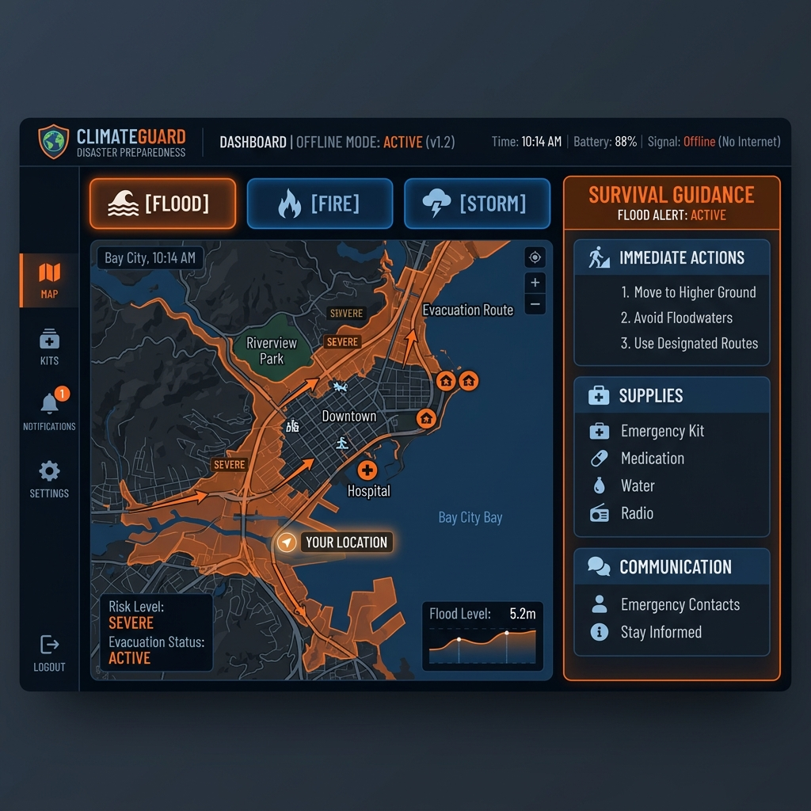

# 🛡️ ClimateGuard — Offline Disaster Preparedness Assistant



**ClimateGuard** is an offline-first AI assistant designed to provide life-saving, real-time survival guidance to communities in climate-vulnerable regions. By running entirely on-device, it remains functional when power and internet connectivity are lost during disasters.

## 🚀 Key Features
- **Zero Internet Required**: Powered by local LLMs via Ollama.
- **Native Function Calling**: Uses Gemma 3/4 native tool-calling for environment analysis.
- **Multilingual Support**: Real-time guidance in **Hindi & English** for the Global South.
- **Multimodal Analysis**: Upload photos of threats (flood, fire) for instant visual risk assessment.
- **Low-Resource Optimized**: Runs on consumer hardware (8GB RAM) using Gemma 4 E4B.

## 🔧 Tech Stack
- **AI Model**: Gemma 3/4 (gemma3:4b)
- **Offline Runtime**: Ollama
- **Fine-tuning**: Unsloth QLoRA (4-bit quantization)
- **Backend**: Python + FastAPI (httpx async)
- **Frontend**: Vanilla HTML/CSS/JS (Zero framework dependencies)

## 🛠️ Setup Instructions

### 1. Prerequisites
- Install [Ollama](https://ollama.com/)
- Pull the required model:
  ```bash
  ollama pull gemma3:4b
  ```

### 2. Environment Setup
```bash
# Clone the repository
git clone https://github.com/angel25bcs10712-stack/climate-guard.git
cd ClimateGuard

# Install dependencies
pip install -r requirements.txt
```

### 3. Run the Application
```bash
python main.py
```
Access the dashboard at `http://localhost:8000`. If Ollama is offline, the app will automatically enter **Demo Mode**.

## 📂 Project Structure
- `main.py`: Async FastAPI backend with tool-calling and demo fallback.
- `Kaggle_notebook.ipynb`: Proof of fine-tuning on Kaggle T4 GPU.
- `finetune_gemma.py`: Unsloth fine-tuning script.
- `training_data.json`: Curated dataset for disaster survival reasoning.
- `templates/index.html`: High-contrast dashboard for emergency use.

## 🏆 Prize Tracks
- **Global Resilience**: Serving the most climate-vulnerable communities.
- **Ollama Special Mention**: Local deployment and model serving.
- **Unsloth Special Mention**: Efficient fine-tuning for domain adaptation.

---
*Built for the Gemma 4 Good Hackathon — Ensuring safety when the world goes offline.*
